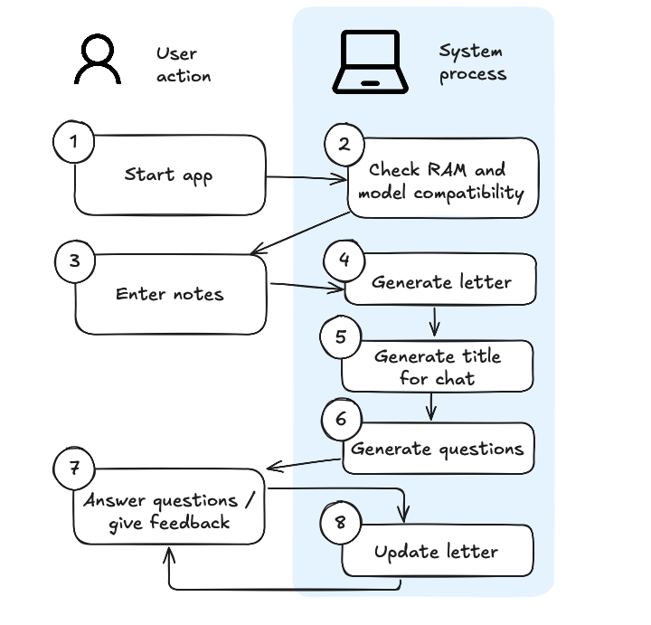
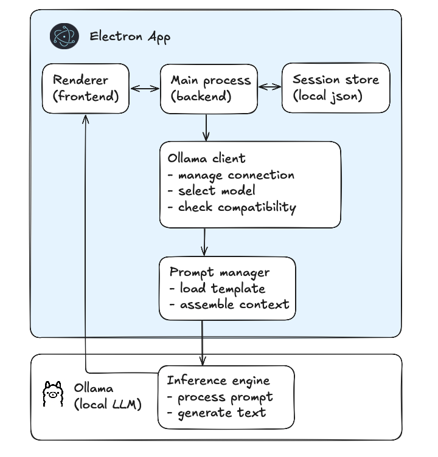

# Phys.IO

Phys.IO is a proof of concept desktop app that transforms clinical shorthand notes into physiotherapy referral letters using local AI.

## Features

- **Privacy First**: All processing happens on your device via Ollama, so no internet connection is required after set up
- **Time Saving**: Converts shorthand into structured, professional correspondence
- **Clarifying**: Identifies information gaps and asks targeted questions

## Disclaimer

PROTOTYPE ONLY - NOT FOR CLINICAL USE

Phys.IO is provided "as is" without warranty. AI outputs have not been clinically validated and must be reviewed by qualified professionals before any use.

No responsibility taken for decisions based on this application's outputs.

Users are responsible for data protection compliance. This app has not been formally assessed against GDPR or privacy frameworks. Process patient data at your own risk.

This rapid prototype is for concept exploration only and may change significantly in future versions.
  
## Screenshots

Please note that the patient data here is *entirely fictional and generated by Claude*. The referral letter and clarifying questions in the screenshots are generated by a model running locally on my device, based on the fictional patient notes. 


## Quick Start

### Prerequisites

1. Recommended minimum specs: 8gb ram for small models (<8b parameters), 16gb+ for medium models (>8b parameters)
2. Install [Ollama](https://ollama.ai/download)
3. Run Ollama and pull a compatible model:
   ```
   ollama pull deepseek-r1:8b
   ```

### Installation

```bash
# Clone the repository
git clone https://github.com/yourusername/phys.io.git

# Navigate to project directory
cd phys.io

# Install dependencies
npm install

# Run the application
npm start
```

## How It Works

1. Enter notes from a physiotherapy session into the app
2. Phys.IO converts them to a professional letter
3. AI identifies missing information and asks clarifying questions
4. Answer the questions to improve the output
5. Export the final letter as needed

## Process Flow



## System Architecture



## Prompt engineering approach

- Main prompt was evolved through 3 versions (v1-v3), with iteration based on physiotherapist feedback. 
- Prompts were developed using a test set of 3 fictional patients with paired clinical notes and reference letters written by a qualified physiotherapist. Each prompt version was evalauted against specific criteria using automated LLM evaluation to enable rapid development (see test/eval.py for evaluation pipeline).

## Privacy & Security

- All data processing happens locally on your device
- No data is sent to external servers

## Development Status

This is a prototype. Not for clinical use without proper review.

## License

[MIT](./LICENSE)